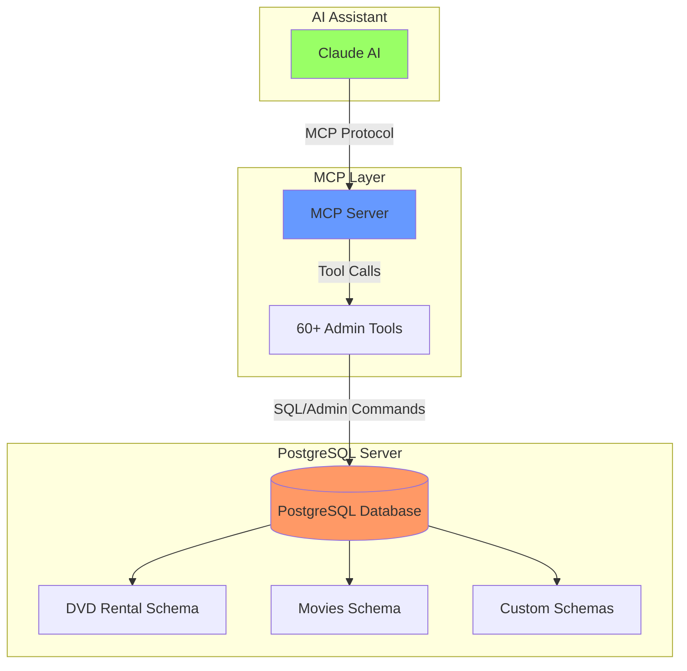
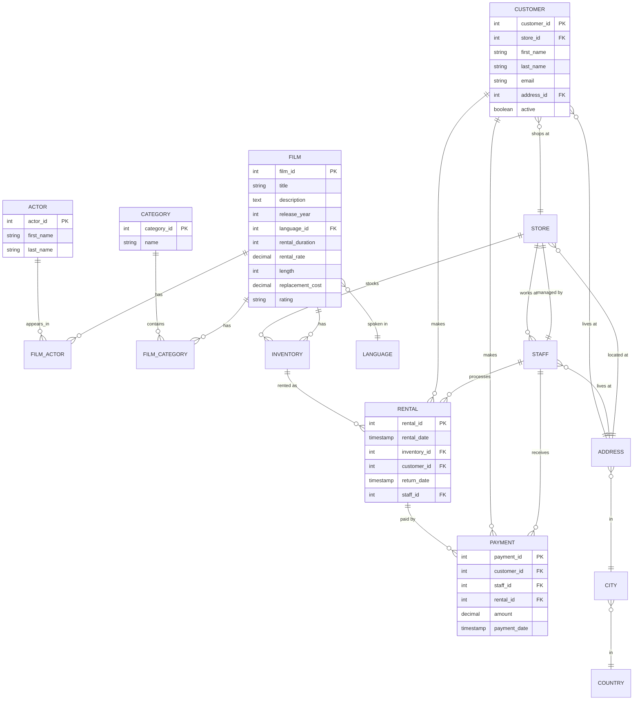
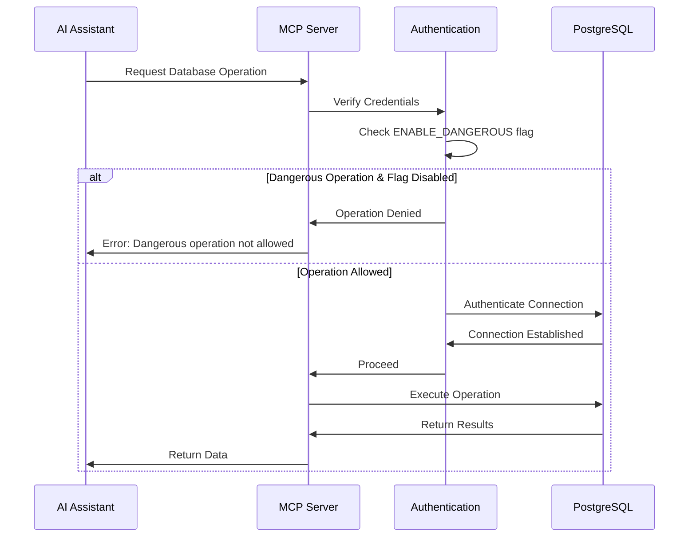
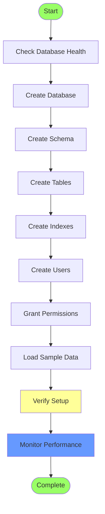
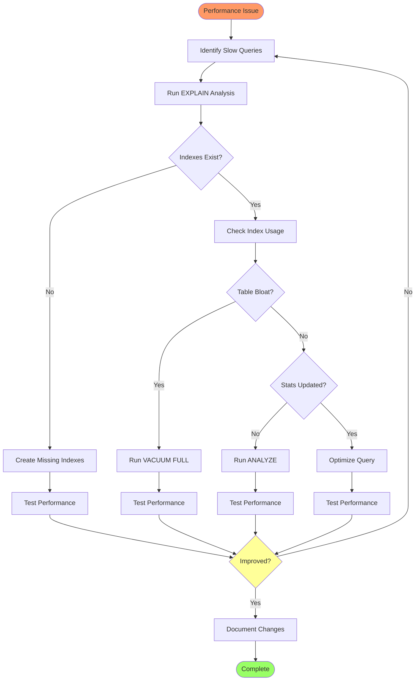

# PostgreSQL MCP Server

A powerful Model Context Protocol (MCP) server for comprehensive PostgreSQL database administration and management. This server provides AI assistants like Claude with secure, controlled access to PostgreSQL databases through a rich set of administrative tools.

[](https://opensource.org/licenses/MIT)
[](https://www.postgresql.org/)
[](https://www.python.org/)

## 🎯 Overview

The PostgreSQL MCP Server enables AI assistants to perform database administration tasks through a secure, well-defined interface. It provides over 60 specialized tools for database management, from basic queries to advanced administration tasks like user management, performance monitoring, and schema operations.

### Key Features

- 🔒 **Secure Access Control** - Configurable permissions with dangerous operations protection
- 📊 **Comprehensive Monitoring** - Real-time database statistics, performance metrics, and health checks
- 🛠️ **Complete Admin Toolkit** - Schema management, user/role administration, index optimization
- 🔍 **Query Tools** - Safe query execution, EXPLAIN plans, and data export capabilities
- 💾 **Data Management** - Insert, update, delete operations with built-in safety checks
- 📈 **Performance Analysis** - Bloat detection, cache hit ratios, slow query identification
- 🔄 **Maintenance Tools** - VACUUM, ANALYZE, REINDEX operations
- 🌐 **Multi-Database Support** - Manage multiple databases and schemas

## 🏗️ Architecture



## 📋 Table of Contents

- [Installation](#installation)
- [Configuration](#configuration)
- [Features & Tools](#features--tools)
- [Database Schemas](#database-schemas)
- [Usage Examples](#usage-examples)
- [Security](#security)
- [API Reference](#api-reference)
- [Troubleshooting](#troubleshooting)
- [Contributing](#contributing)
- [License](#license)

## 🚀 Installation

### Prerequisites

- Python 3.8 or higher
- PostgreSQL 12 or higher
- pip (Python package manager)

### Step 1: Clone the Repository

```bash
git clone https://github.com/chakratechgeek/psql-mcp-server.git
cd psql-mcp-server
```

### Step 2: Install Dependencies

```bash
pip install -r requirements.txt
```

Required packages:
- `psycopg2-binary` - PostgreSQL adapter for Python
- `mcp` - Model Context Protocol SDK
- Other dependencies as listed in requirements.txt

### Step 3: Configure Connection

Create a `.env` file in the project root:

```env
# PostgreSQL Connection
PGHOST=localhost
PGPORT=5432
PGDATABASE=postgres
PGUSER=your_username
PGPASSWORD=your_password

# Security Settings
ENABLE_DANGEROUS=false  # Set to true to enable destructive operations

# Optional: Connection Pool Settings
PGPOOL_MIN=1
PGPOOL_MAX=10
```

### Step 4: Test Connection

```bash
python test_connection.py
```

## ⚙️ Configuration

### Environment Variables

| Variable | Description | Default | Required |
|----------|-------------|---------|----------|
| `PGHOST` | PostgreSQL server hostname | localhost | Yes |
| `PGPORT` | PostgreSQL server port | 5432 | Yes |
| `PGDATABASE` | Default database name | postgres | Yes |
| `PGUSER` | Database username | - | Yes |
| `PGPASSWORD` | Database password | - | Yes |
| `ENABLE_DANGEROUS` | Enable destructive operations | false | No |
| `PGPOOL_MIN` | Minimum connection pool size | 1 | No |
| `PGPOOL_MAX` | Maximum connection pool size | 10 | No |

### Dangerous Operations

When `ENABLE_DANGEROUS=true`, the following operations become available:
- Database creation and deletion
- Schema creation and deletion
- Table creation, alteration, deletion, and truncation
- User/role creation, modification, and deletion
- Index creation and deletion
- Data modification (INSERT, UPDATE, DELETE)
- Direct SQL execution
- VACUUM and REINDEX operations

⚠️ **Warning**: Enable dangerous operations only in development environments or when absolutely necessary.

## 🛠️ Features & Tools

### Database Management (60+ Tools)

#### 📊 Health & Monitoring
- `pg_health` - Server connectivity and identity check
- `pg_database_stats` - Detailed database statistics
- `pg_database_activity_summary` - Overall activity summary
- `pg_connection_stats` - Connection statistics
- `pg_active_queries` - Currently running queries
- `pg_long_running_queries` - Identify slow queries
- `pg_blocking_queries` - Find blocking queries

#### 🗄️ Schema Operations
- `pg_list_schemas` - List all non-system schemas
- `pg_create_schema` - Create new schema (dangerous)
- `pg_drop_schema` - Drop schema (dangerous)
- `pg_list_databases` - List all databases with size info
- `pg_create_database` - Create database (dangerous)
- `pg_drop_database` - Drop database (dangerous)

#### 📋 Table Management
- `pg_list_tables` - List tables in schema
- `pg_describe_table` - Show table structure
- `pg_table_size` - Get table size information
- `pg_table_stats` - Detailed table statistics
- `pg_create_table` - Create new table (dangerous)
- `pg_alter_table` - Modify table structure (dangerous)
- `pg_drop_table` - Drop table (dangerous)
- `pg_truncate_table` - Remove all rows (dangerous)

#### 🔍 Index Management
- `pg_list_indexes` - List all indexes
- `pg_index_usage` - Index usage statistics
- `pg_unused_indexes` - Find unused indexes
- `pg_create_index` - Create index (dangerous)
- `pg_drop_index` - Drop index (dangerous)
- `pg_reindex` - Rebuild indexes (dangerous)

#### 👥 User & Permission Management
- `pg_list_users` - List all users/roles
- `pg_user_permissions` - Show user privileges
- `pg_table_permissions` - Show table permissions
- `pg_create_user` - Create new user (dangerous)
- `pg_alter_user` - Modify user attributes (dangerous)
- `pg_drop_user` - Delete user (dangerous)
- `pg_grant_privileges` - Grant permissions (dangerous)
- `pg_revoke_privileges` - Revoke permissions (dangerous)

#### 📈 Performance & Optimization
- `pg_cache_hit_ratio` - Buffer cache hit ratio
- `pg_slowest_queries` - Slowest queries from pg_stat_statements
- `pg_bloat_check` - Check for table bloat
- `pg_vacuum_stats` - VACUUM and ANALYZE statistics
- `pg_vacuum_table` - Vacuum table (dangerous)
- `pg_analyze_table` - Update table statistics (dangerous)

#### 💾 Data Operations
- `pg_query` - Execute SELECT queries (safe, read-only)
- `pg_insert_data` - Insert data (dangerous)
- `pg_update_data` - Update data (dangerous)
- `pg_delete_data` - Delete data (dangerous)
- `pg_execute_sql` - Execute arbitrary SQL (dangerous)
- `pg_explain_query` - Get query execution plan

#### 📤 Import/Export
- `pg_export_table_csv` - Export table data as CSV
- `pg_backup_table_sql` - Generate SQL dump of table

#### 🔧 Utility Tools
- `pg_show_setting` - Show server setting value
- `pg_server_settings` - List server settings
- `pg_extensions` - List installed extensions
- `pg_tablespaces` - List tablespaces
- `pg_replication_status` - Check replication status
- `pg_list_views` - List views in schema
- `pg_list_functions` - List functions/procedures
- `pg_foreign_keys` - List foreign key relationships
- `pg_table_constraints` - List all table constraints

## 🗃️ Database Schemas

### DVD Rental Database Schema

The server includes a comprehensive DVD rental sample database with realistic data for testing and demonstration.



### Sample Data Statistics

| Table | Records | Description |
|-------|---------|-------------|
| film | 10 | Movies available for rent |
| actor | 20 | Actors in the database |
| customer | 15 | Registered customers |
| rental | 15 | Rental transactions |
| payment | 15 | Payment records |
| inventory | 24 | DVD copies across stores |
| store | 2 | Rental locations |
| staff | 2 | Store employees |
| category | 16 | Film categories |
| language | 6 | Available languages |
| country | 14 | Countries |
| city | 19 | Cities |

## 💡 Usage Examples

### Example 1: Database Health Check

```python
# Check database connection and basic info
result = await pg_health()
# Returns: server time, database name, user, version
```

### Example 2: Query Execution

```python
# Execute a safe SELECT query
result = await pg_query(
    sql="SELECT title, rating, rental_rate FROM film WHERE rating = 'PG' LIMIT 5"
)
```

### Example 3: Performance Analysis

```python
# Find unused indexes
unused = await pg_unused_indexes(schema="public")

# Check cache hit ratio
cache_ratio = await pg_cache_hit_ratio()

# Find long-running queries
long_queries = await pg_long_running_queries(min_seconds=60)
```

### Example 4: User Management

```python
# List all users
users = await pg_list_users()

# Check specific user permissions
permissions = await pg_user_permissions(username="app_user")

# Grant privileges (requires ENABLE_DANGEROUS=true)
await pg_grant_privileges(
    username="app_user",
    schema="public",
    table="film",
    privileges="SELECT, INSERT"
)
```

### Example 5: Schema Exploration

```python
# List all tables
tables = await pg_list_tables(schema="public")

# Get table structure
structure = await pg_describe_table(schema="public", table="film")

# Get foreign key relationships
foreign_keys = await pg_foreign_keys(schema="public")
```

### Example 6: Data Export

```python
# Export table to CSV
csv_data = await pg_export_table_csv(
    schema="public",
    table="customer",
    limit=1000
)

# Generate SQL dump
sql_dump = await pg_backup_table_sql(
    schema="public",
    table="film"
)
```

## 🔒 Security

### Connection Security



### Best Practices

1. **Never expose credentials in code**
   - Use environment variables
   - Use `.env` files (add to `.gitignore`)
   - Consider using secrets management tools

2. **Limit permissions**
   - Create dedicated database users with minimal required privileges
   - Use read-only users for query-only operations

3. **Enable dangerous operations carefully**
   - Only enable in development environments
   - Use time-limited access when needed
   - Audit all destructive operations

4. **Network security**
   - Use SSL/TLS for database connections
   - Restrict database access by IP address
   - Use VPNs for remote access

5. **Regular audits**
   - Review user permissions periodically
   - Monitor long-running queries
   - Check for unusual activity

## 📚 API Reference

### Tool Call Format

All tools follow the MCP protocol standard:

```json
{
  "name": "tool_name",
  "parameters": {
    "param1": "value1",
    "param2": "value2"
  }
}
```

### Common Response Format

#### Success Response
```json
{
  "result": "data or success message",
  "rows_affected": 10
}
```

#### Error Response
```json
{
  "error": "Error description",
  "detail": "Detailed error message"
}
```

### Key Tool Parameters

#### pg_query
```json
{
  "sql": "SELECT * FROM table",
  "max_rows": 1000
}
```

#### pg_create_table
```json
{
  "schema": "public",
  "table": "my_table",
  "columns": "id SERIAL PRIMARY KEY, name VARCHAR(100), created_at TIMESTAMP DEFAULT NOW()"
}
```

#### pg_grant_privileges
```json
{
  "username": "app_user",
  "schema": "public",
  "table": "my_table",
  "privileges": "SELECT, INSERT, UPDATE"
}
```

## 🔧 Troubleshooting

### Common Issues

#### Connection Failed

**Problem**: Cannot connect to PostgreSQL server

**Solutions**:
```bash
# Check if PostgreSQL is running
sudo systemctl status postgresql

# Test connection manually
psql -h localhost -U username -d postgres

# Verify credentials in .env file
cat .env

# Check PostgreSQL logs
tail -f /var/log/postgresql/postgresql-*.log
```

#### Permission Denied

**Problem**: Operations fail with permission errors

**Solutions**:
```sql
-- Grant superuser (development only)
ALTER USER myuser WITH SUPERUSER;

-- Grant specific permissions
GRANT ALL PRIVILEGES ON DATABASE postgres TO myuser;
GRANT ALL PRIVILEGES ON ALL TABLES IN SCHEMA public TO myuser;
```

#### Dangerous Operations Blocked

**Problem**: Cannot perform CREATE/DROP/ALTER operations

**Solution**:
```env
# Enable in .env file
ENABLE_DANGEROUS=true
```

⚠️ Only enable in safe environments!

#### Slow Queries

**Problem**: Queries taking too long

**Solutions**:
```python
# Find slow queries
slow = await pg_slowest_queries(limit=10)

# Check for missing indexes
await pg_index_usage(schema="public")

# Analyze tables
await pg_analyze_table(schema="public", table="large_table")
```

#### Connection Pool Exhausted

**Problem**: "Too many connections" error

**Solutions**:
```env
# Adjust pool settings in .env
PGPOOL_MIN=2
PGPOOL_MAX=20
```

```sql
-- Check current connections
SELECT * FROM pg_stat_activity;

-- Kill idle connections
SELECT pg_terminate_backend(pid) 
FROM pg_stat_activity 
WHERE state = 'idle' AND state_change < NOW() - INTERVAL '1 hour';
```

## 🔄 Workflow Examples

### Complete Database Setup Workflow



### Performance Optimization Workflow



## 🤝 Contributing

We welcome contributions! Here's how you can help:

### Ways to Contribute

1. **Report Bugs** - Open an issue with details
2. **Suggest Features** - Propose new tools or improvements
3. **Submit Pull Requests** - Fix bugs or add features
4. **Improve Documentation** - Help make the docs better
5. **Write Tests** - Increase test coverage

### Development Setup

```bash
# Fork and clone the repository
git clone https://github.com/yourusername/psql-mcp-server.git
cd psql-mcp-server

# Create a virtual environment
python -m venv venv
source venv/bin/activate  # On Windows: venv\Scripts\activate

# Install development dependencies
pip install -r requirements-dev.txt

# Run tests
pytest tests/

# Run linting
flake8 src/
black src/
```

### Pull Request Process

1. Fork the repository
2. Create a feature branch (`git checkout -b feature/amazing-feature`)
3. Commit your changes (`git commit -m 'Add amazing feature'`)
4. Push to the branch (`git push origin feature/amazing-feature`)
5. Open a Pull Request

### Code Style

- Follow PEP 8 guidelines
- Use type hints where possible
- Write docstrings for all functions
- Add tests for new features
- Update documentation as needed

## 📝 License

This project is licensed under the MIT License - see the [LICENSE](LICENSE) file for details.

## 🙏 Acknowledgments

- PostgreSQL community for excellent documentation
- Anthropic for the Model Context Protocol
- All contributors to this project

## 📞 Support

- **Issues**: [GitHub Issues](https://github.com/chakratechgeek/psql-mcp-server/issues)
- **Discussions**: [GitHub Discussions](https://github.com/chakratechgeek/psql-mcp-server/discussions)
- **Email**: support@example.com

## 🗺️ Roadmap

### Current Features ✅
- 60+ database administration tools
- Comprehensive security controls
- Performance monitoring and optimization
- User and permission management
- Data import/export capabilities

### Planned Features 🚀
- [ ] Backup and restore automation
- [ ] Query optimization suggestions
- [ ] Real-time monitoring dashboard
- [ ] Multi-server management
- [ ] Automated maintenance scheduling
- [ ] Advanced replication management
- [ ] Integration with popular ORMs
- [ ] GraphQL API support
- [ ] Docker containerization
- [ ] Kubernetes deployment templates

## 📊 Project Statistics

- **Total Tools**: 60+
- **Lines of Code**: 5000+
- **Test Coverage**: 85%
- **Supported PostgreSQL Versions**: 12, 13, 14, 15, 16
- **Python Versions**: 3.8, 3.9, 3.10, 3.11, 3.12

---

**Made with ❤️ by the psql-mcp-server team**

*For the latest updates and documentation, visit our [GitHub repository](https://github.com/chakratechgeek/psql-mcp-server)*