# PostgreSQL + Filesystem + Git + Notes MCP Server

A comprehensive Model Context Protocol (MCP) server that combines PostgreSQL database administration, filesystem management, git version control, and note-taking capabilities. Built with FastMCP on Python, this server provides AI assistants like Claude with powerful, secure system administration tools.

---

## 🎬 **LIVE INTERACTIVE DEMO**

**[👉 CLICK HERE TO OPEN THE INTERACTIVE DEMO 👈](https://raw.githack.com/chakratechgeek/psql-mcp-server/main/demo/mcp-server-demo.html)**

### Demo Features:
<table>
<tr>
<td width="50%">

#### 🎮 **Interactive Controls**
- ✅ Click buttons to simulate operations
- ✅ Watch live animated console
- ✅ See data flow visualization
- ✅ 6 different demo scenarios

</td>
<td width="50%">

#### 📊 **What You'll See**
- Database health checks
- Listing databases & tables
- File system operations
- Git status commands
- Performance monitoring
- Real-time animations

</td>
</tr>
</table>

### How to Use the Demo:

**Option 1: View Online (Recommended)**
```
Click the link above to open in your browser instantly!
```

**Option 2: Local File**
```bash
# Download and open locally
git clone https://github.com/chakratechgeek/psql-mcp-server.git
cd psql-mcp-server
open demo/mcp-server-demo.html  # Mac
start demo/mcp-server-demo.html  # Windows
xdg-open demo/mcp-server-demo.html  # Linux
```

### Demo Preview:

```
┌─────────────────────────────────────────────────────────────┐
│            🚀 PostgreSQL MCP Server Demo                    │
│           Interactive Visual Demonstration                  │
├─────────────────────────────────────────────────────────────┤
│                                                             │
│  📊 Server Overview                                         │
│  ┌─────┐ ┌─────┐ ┌─────┐ ┌─────┐ ┌─────┐                 │
│  │ 119 │ │  74 │ │  30 │ │  13 │ │  2  │                 │
│  │Tools│ │ PG  │ │ Git │ │ FS  │ │Note │                 │
│  └─────┘ └─────┘ └─────┘ └─────┘ └─────┘                 │
│                                                             │
│  🏗️ System Architecture                                    │
│  👤 You → 🤖 Claude → 🔌 MCP → 🖥️ VM                      │
│                                                             │
│  🎮 Interactive Demo Controls                              │
│  [🏥 Health] [📚 DBs] [📁 Files] [🔧 Git]                 │
│  [⚡ Performance] [📊 Tables] [🗑️ Clear]                   │
│                                                             │
│  💻 Live Console Output                                    │
│  ┌───────────────────────────────────────────────┐        │
│  │ $ User: "Check my database health"            │        │
│  │ 🤖 Claude: Calling pg_health()...             │        │
│  │ 🔌 Connecting to PostgreSQL...                │        │
│  │ ✓ Connected successfully!                     │        │
│  │ 📊 Server: PostgreSQL 16.10                   │        │
│  │ ✅ Database is healthy!                        │        │
│  └───────────────────────────────────────────────┘        │
│                                                             │
│  🔄 Command Flow Visualization                             │
│  [Request] → [Parse] → [Execute] → [Process] → [Response] │
│                                                             │
└─────────────────────────────────────────────────────────────┘
```

---

## Overview

**Server Name:** `LocalNotes+Postgres+FileSystem+Git`  
**Framework:** FastMCP  
**Port:** 8000  
**Total Tools:** 119+

This MCP server integrates four major categories of system administration tools into a single interface:

1. **Notes Management** (2 tools) - Simple note-taking functionality
2. **Filesystem Operations** (13 tools) - Complete file and directory management
3. **Git Version Control** (30 tools) - Full git repository operations
4. **PostgreSQL Administration** (74+ tools) - Comprehensive database management

## Architecture

### System Architecture Diagram


### Data Flow Architecture

```mermaid
sequenceDiagram
    participant Client as AI Client
    participant MCP as FastMCP Server
    participant Auth as Security Layer
    participant FS as File System
    participant Git as Git Repository
    participant Pool as Connection Pool
    participant PG as PostgreSQL

    Note over Client,PG: Example: Database Query Workflow
    Client->>MCP: pg_query(sql="SELECT * FROM users")
    MCP->>Auth: Check ENABLE_DANGEROUS flag
    Auth-->>MCP: Safe operation (read-only)
    MCP->>Pool: Get connection from pool
    Pool->>PG: Execute SELECT query
    PG-->>Pool: Return results
    Pool-->>MCP: Query results
    MCP-->>Client: Return data

    Note over Client,PG: Example: Write Operation Workflow
    Client->>MCP: pg_create_table(...)
    MCP->>Auth: Check ENABLE_DANGEROUS flag
    alt ENABLE_DANGEROUS=false
        Auth-->>MCP: Operation blocked
        MCP-->>Client: Error: requires ENABLE_DANGEROUS
    else ENABLE_DANGEROUS=true
        Auth-->>MCP: Operation allowed
        MCP->>Pool: Get connection from pool
        Pool->>PG: Execute CREATE TABLE
        PG-->>Pool: Success
        Pool-->>MCP: Operation complete
        MCP-->>Client: Success response
    end

    Note over Client,Git: Example: Git Workflow
    Client->>MCP: git_status(repo_path)
    MCP->>Git: Execute git status command
    Git-->>MCP: Status output
    MCP-->>Client: Return status

    Note over Client,FS: Example: Filesystem Workflow
    Client->>MCP: fs_read_file(path)
    MCP->>FS: Read file contents
    FS-->>MCP: File data
    MCP-->>Client: Return contents
```



### Component Interaction Diagram


## Installation

### Prerequisites

- Python 3.12 or higher
- PostgreSQL 12+ (for database features)
- Git (for version control features)

### Setup

1. Clone or download this repository

2. Install dependencies:
```bash
pip install fastapi mcp psycopg python-dotenv psycopg-pool
```

3. Create `.env` file for PostgreSQL connection:
```env
PGHOST=localhost
PGPORT=5432
PGDATABASE=your_database
PGUSER=your_username
PGPASSWORD=your_password
PGSSLMODE=prefer
ENABLE_DANGEROUS=false  # Set to true for write operations
```

4. Run the server:
```bash
python main.py
```

The server will start on `0.0.0.0:8000` and accept MCP connections.

## Features

### 1. Notes Management Tools (2 tools)

Simple text file-based note management in `notes.txt`.

| Tool | Description |
|------|-------------|
| `add_note` | Append a note line to notes.txt |
| `read_notes` | Read notes.txt content (with truncation support) |

**Example:**
```python
add_note(content="Remember to backup database")
read_notes(max_chars=20000)
```

### 2. Filesystem Administration Tools (13 tools)

Complete file and directory management with safety checks.

| Tool | Description |
|------|-------------|
| `fs_read_file` | Read text file contents |
| `fs_write_file` | Write or append content to files |
| `fs_list_directory` | List directory contents with details |
| `fs_create_directory` | Create directories (recursive support) |
| `fs_delete_file` | Delete a file |
| `fs_delete_directory` | Delete directories (recursive support) |
| `fs_move` | Move or rename files/directories |
| `fs_copy` | Copy files or directories |
| `fs_search_files` | Search files by pattern (glob wildcards) |
| `fs_file_info` | Get detailed file/directory information |
| `fs_get_disk_usage` | Get disk usage statistics |

**Example:**
```python
fs_list_directory(path="/home/user", show_hidden=False)
fs_read_file(path="/path/to/file.txt", max_chars=50000)
fs_copy(source="/source/path", destination="/dest/path", recursive=True)
```

### 3. Git Version Control Operations (30 tools)

Full-featured git operations for repository management.

#### Repository Management
| Tool | Description |
|------|-------------|
| `git_init` | Initialize new git repository |
| `git_clone` | Clone a remote repository |
| `git_status` | Get repository status |

#### Basic Operations
| Tool | Description |
|------|-------------|
| `git_add` | Stage files for commit |
| `git_commit` | Commit staged changes |
| `git_push` | Push commits to remote |
| `git_pull` | Pull changes from remote |
| `git_fetch` | Fetch changes without merging |

#### Branch Management
| Tool | Description |
|------|-------------|
| `git_branch_list` | List branches (local/remote) |
| `git_branch_create` | Create new branch |
| `git_branch_delete` | Delete a branch |
| `git_checkout` | Checkout branch or commit |
| `git_merge` | Merge branch into current |

#### History & Diff
| Tool | Description |
|------|-------------|
| `git_log` | View commit history |
| `git_diff` | Show changes in working tree |
| `git_show` | Show commit details |

#### Remote Management
| Tool | Description |
|------|-------------|
| `git_remote_list` | List remote repositories |
| `git_remote_add` | Add remote repository |
| `git_remote_remove` | Remove remote repository |

#### Stash Operations
| Tool | Description |
|------|-------------|
| `git_stash_save` | Stash current changes |
| `git_stash_pop` | Apply and remove latest stash |
| `git_stash_list` | List all stashes |

#### Tags
| Tool | Description |
|------|-------------|
| `git_tag_create` | Create a tag |
| `git_tag_list` | List all tags |

#### Advanced
| Tool | Description |
|------|-------------|
| `git_reset` | Reset HEAD (soft/mixed/hard) |
| `git_config_get` | Get configuration value |
| `git_config_set` | Set configuration value |

**Example:**
```python
git_init(path="/project/path")
git_add(repo_path="/project/path", files=".")
git_commit(repo_path="/project/path", message="Initial commit")
git_push(repo_path="/project/path", remote="origin", branch="main")
```

### 4. PostgreSQL Administration Tools (74+ tools)

#### Basic Database Operations
| Tool | Description |
|------|-------------|
| `pg_health` | Check server connectivity and identity |
| `pg_list_schemas` | List all non-system schemas |
| `pg_list_tables` | List tables in a schema |
| `pg_describe_table` | Show table structure and columns |
| `pg_show_setting` | Show server configuration setting |

#### Database Management
| Tool | Description | Requires DANGEROUS |
|------|-------------|-------------------|
| `pg_list_databases` | List all databases with size info | No |
| `pg_database_stats` | Get detailed database statistics | No |
| `pg_create_database` | Create new database | **Yes** |
| `pg_drop_database` | Drop database | **Yes** |

#### Schema Management
| Tool | Description | Requires DANGEROUS |
|------|-------------|-------------------|
| `pg_create_schema` | Create new schema | **Yes** |
| `pg_drop_schema` | Drop schema (with cascade option) | **Yes** |

#### Table Operations
| Tool | Description | Requires DANGEROUS |
|------|-------------|-------------------|
| `pg_table_size` | Get table size information | No |
| `pg_table_stats` | Get detailed table statistics | No |
| `pg_bloat_check` | Check for table bloat | No |
| `pg_create_table` | Create new table | **Yes** |
| `pg_drop_table` | Drop table | **Yes** |
| `pg_alter_table` | Alter table structure | **Yes** |
| `pg_truncate_table` | Remove all rows from table | **Yes** |

#### Index Management
| Tool | Description | Requires DANGEROUS |
|------|-------------|-------------------|
| `pg_list_indexes` | List indexes for tables | No |
| `pg_index_usage` | Show index usage statistics | No |
| `pg_unused_indexes` | Find unused indexes | No |
| `pg_create_index` | Create index (btree/hash/gist/gin/brin) | **Yes** |
| `pg_drop_index` | Drop index | **Yes** |
| `pg_reindex` | Rebuild indexes | **Yes** |

#### Schema Introspection
| Tool | Description |
|------|-------------|
| `pg_list_views` | List views in schema |
| `pg_view_definition` | Get view SQL definition |
| `pg_list_functions` | List functions/procedures |
| `pg_table_constraints` | List table constraints (PK, FK, unique, check) |
| `pg_foreign_keys` | List foreign key relationships |

#### User & Permission Management
| Tool | Description | Requires DANGEROUS |
|------|-------------|-------------------|
| `pg_list_users` | List all database users/roles | No |
| `pg_user_permissions` | Show user privileges | No |
| `pg_table_permissions` | Show table permissions | No |
| `pg_create_user` | Create new user/role | **Yes** |
| `pg_alter_user` | Modify user attributes | **Yes** |
| `pg_drop_user` | Delete user/role | **Yes** |
| `pg_grant_privileges` | Grant permissions to user | **Yes** |
| `pg_revoke_privileges` | Revoke permissions from user | **Yes** |

#### Performance & Monitoring
| Tool | Description | Requires DANGEROUS |
|------|-------------|-------------------|
| `pg_active_queries` | Show currently running queries | No |
| `pg_long_running_queries` | Find slow running queries | No |
| `pg_blocking_queries` | Find queries blocking others | No |
| `pg_connection_stats` | Get connection statistics | No |
| `pg_locks_summary` | Get summary of current locks | No |
| `pg_cache_hit_ratio` | Show database cache hit ratio | No |
| `pg_slowest_queries` | Get slowest queries (requires pg_stat_statements) | No |
| `pg_kill_query` | Terminate query by PID | **Yes** |
| `pg_cancel_query` | Cancel query by PID (gentler) | **Yes** |

#### Maintenance Operations
| Tool | Description | Requires DANGEROUS |
|------|-------------|-------------------|
| `pg_vacuum_stats` | Show vacuum and analyze statistics | No |
| `pg_vacuum_table` | Vacuum table to reclaim space | **Yes** |
| `pg_analyze_table` | Analyze table to update statistics | **Yes** |
| `pg_replication_status` | Show replication status | No |

#### Data Manipulation (DML)
| Tool | Description | Requires DANGEROUS |
|------|-------------|-------------------|
| `pg_insert_data` | Insert data into table | **Yes** |
| `pg_update_data` | Update data in table | **Yes** |
| `pg_delete_data` | Delete data from table (requires WHERE clause) | **Yes** |

#### Query Execution
| Tool | Description | Requires DANGEROUS |
|------|-------------|-------------------|
| `pg_query` | Execute SELECT queries (read-only, safe) | No |
| `pg_execute_sql` | Execute arbitrary SQL | **Yes** |
| `pg_explain_query` | Get query execution plan | No |

#### Export Operations
| Tool | Description |
|------|-------------|
| `pg_export_table_csv` | Export table data as CSV |
| `pg_backup_table_sql` | Generate SQL dump of table |

#### System Information
| Tool | Description |
|------|-------------|
| `pg_server_settings` | List server configuration settings |
| `pg_extensions` | List installed PostgreSQL extensions |
| `pg_tablespaces` | List available tablespaces |
| `pg_database_activity_summary` | Get overall database activity summary |

## Security

### ENABLE_DANGEROUS Flag

Many PostgreSQL operations require the `ENABLE_DANGEROUS=true` environment variable to be set. This is a safety mechanism to prevent accidental:

- Database/schema/table creation or deletion
- Data modification (INSERT, UPDATE, DELETE)
- User management operations
- Index creation/deletion
- Direct SQL execution

**Safe Operations (no DANGEROUS flag needed):**
- All read-only queries (`pg_query`)
- Schema and table introspection
- Performance monitoring
- Viewing statistics and configurations

**Dangerous Operations (requires ENABLE_DANGEROUS=true):**
- CREATE, DROP, ALTER operations
- INSERT, UPDATE, DELETE operations
- User and permission management
- VACUUM, ANALYZE, REINDEX
- Direct SQL execution

### Connection Security

The server uses PostgreSQL connection pooling with the following configuration:
- Min connections: 1
- Max connections: 5
- SSL mode: Configurable via `PGSSLMODE` (default: `prefer`)

### Best Practices

1. **Never commit `.env` file** - Keep credentials secure
2. **Use least privilege** - Create dedicated users with minimal required permissions
3. **Enable DANGEROUS only when needed** - Keep it disabled in production
4. **Monitor queries** - Use `pg_active_queries` and `pg_long_running_queries`
5. **Regular maintenance** - Use `pg_vacuum_table` and `pg_analyze_table`
6. **Audit operations** - Review git history and database logs

## Configuration

### Environment Variables

| Variable | Description | Default | Required |
|----------|-------------|---------|----------|
| `PGHOST` | PostgreSQL server hostname | - | Yes |
| `PGPORT` | PostgreSQL server port | 5432 | No |
| `PGDATABASE` | Database name | - | Yes |
| `PGUSER` | Database username | - | Yes |
| `PGPASSWORD` | Database password | - | Yes |
| `PGSSLMODE` | SSL connection mode | prefer | No |
| `ENABLE_DANGEROUS` | Enable write/destructive operations | false | No |

### Connection Pool Settings

The server uses a connection pool for better performance:
- Minimum connections: 1
- Maximum connections: 5
- Connection factory: `dict_row` (returns results as dictionaries)

## Usage Examples

### Example 1: Repository Setup and Database Creation

```python
# Initialize git repository
git_init(path="/project/myapp")

# Add remote
git_remote_add(repo_path="/project/myapp", name="origin", url="https://github.com/user/myapp.git")

# Check database health
pg_health()

# Create database (requires ENABLE_DANGEROUS=true)
pg_create_database(database="myapp_db", encoding="UTF8")
```

### Example 2: Database Schema Setup

```python
# Create schema
pg_create_schema(schema="app", authorization="myuser")

# Create table
pg_create_table(
    schema="app",
    table="users",
    columns="id SERIAL PRIMARY KEY, username VARCHAR(100) UNIQUE NOT NULL, email VARCHAR(255), created_at TIMESTAMP DEFAULT NOW()"
)

# Create index
pg_create_index(
    schema="app",
    table="users",
    index_name="idx_users_email",
    columns="email",
    method="btree"
)
```

### Example 3: Performance Monitoring

```python
# Check cache hit ratio
pg_cache_hit_ratio()

# Find slow queries
pg_long_running_queries(min_seconds=30)

# Check for table bloat
pg_bloat_check(schema="public")

# Find unused indexes
pg_unused_indexes(schema="public")
```

### Example 4: File Management and Git Workflow

```python
# Read configuration file
config = fs_read_file(path="/project/config.yaml")

# Modify and write back
fs_write_file(path="/project/config.yaml", content=modified_config)

# Stage changes
git_add(repo_path="/project", files="config.yaml")

# Commit
git_commit(repo_path="/project", message="Update configuration")

# Push to remote
git_push(repo_path="/project", remote="origin", branch="main")
```

### Example 5: Database Backup

```python
# Export table to CSV
csv_data = pg_export_table_csv(schema="public", table="customers", limit=10000)
fs_write_file(path="/backups/customers.csv", content=csv_data)

# Generate SQL dump
sql_dump = pg_backup_table_sql(schema="public", table="orders")
fs_write_file(path="/backups/orders_dump.sql", content=sql_dump)

# Commit to git
git_add(repo_path="/backups", files=".")
git_commit(repo_path="/backups", message="Database backup")
```

## Error Handling

All tools return error messages in a consistent format:

**Success Response:**
```python
"OK: operation completed successfully"
# or
{"result": "data"}
```

**Error Response:**
```python
"Error: descriptive error message"
# or
{"error": "descriptive error message"}
```

## Troubleshooting

### PostgreSQL Connection Issues

```python
# Test connection
result = pg_health()

# Check server settings
pg_show_setting(name="max_connections")

# View connection statistics
pg_connection_stats()
```

### Git Operation Failures

```python
# Check repository status
git_status(repo_path="/project")

# View git configuration
git_config_get(repo_path="/project", key="user.name")
git_config_get(repo_path="/project", key="user.email")

# Set configuration if needed
git_config_set(repo_path="/project", key="user.name", value="Your Name")
```

### Permission Errors

```python
# Check user permissions
pg_user_permissions(username="myuser")

# Check table permissions
pg_table_permissions(schema="public", table="mytable")

# Grant permissions (requires ENABLE_DANGEROUS=true)
pg_grant_privileges(
    username="myuser",
    schema="public",
    table="mytable",
    privileges="SELECT, INSERT, UPDATE"
)
```

## Development

### File Structure

```
psql-mcp-server/
├── main.py              # Main server implementation (all tools)
├── notes.txt           # Notes storage file
├── demo/
│   └── mcp-server-demo.html  # Interactive visual demo
├── .env                # Configuration (not in git)
├── README.md           # This file
└── requirements.txt    # Python dependencies
```

### Adding New Tools

To add a new tool, decorate a function with `@mcp.tool()`:

```python
@mcp.tool()
def my_new_tool(param1: str, param2: int = 10) -> str:
    """Tool description here."""
    # Implementation
    return "Result"
```

## License

This project is provided as-is for PostgreSQL administration and system management via MCP protocol.

## Support

For issues or questions:
1. Check the error messages - they provide detailed information
2. Review the `.env` configuration
3. Ensure PostgreSQL is running and accessible
4. Verify `ENABLE_DANGEROUS` flag for write operations
5. **[Try the interactive demo](https://raw.githack.com/chakratechgeek/psql-mcp-server/main/demo/mcp-server-demo.html)** to understand how the system works

---

**Total Tools: 119**  
**Server: FastMCP on port 8000**  
**Categories: Notes (2) | Filesystem (13) | Git (30) | PostgreSQL (74+)**  
**🎬 [Interactive Demo Available!](https://raw.githack.com/chakratechgeek/psql-mcp-server/main/demo/mcp-server-demo.html)**
